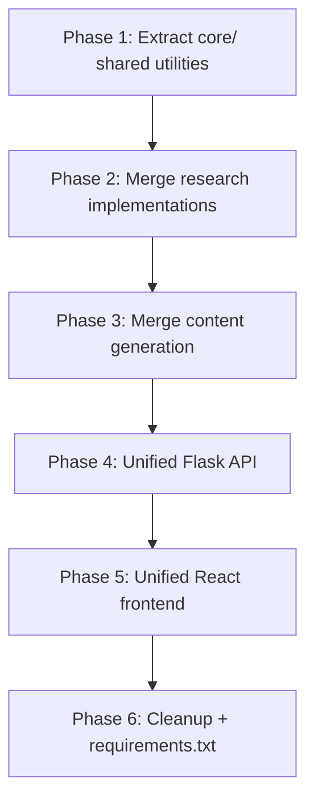

# Consolidation Plan: Three Projects → One Unified Platform

## Background

Three separate projects currently exist, each independently solving overlapping problems around a shared input contract:

```python
input = {
    "name": "Prospect Name",
    "role": "Prospect Role",
    "company": "Prospect Company",
    "website": "https://example.com",
}
```

| Project | Location | Purpose |
|---|---|---|
| `sales-intelligence` | `C:\Projects\sales-intelligence` | Python library + notebooks; company extraction, prospect research, lead analysis, capability content generation, markdown output |
| `prospect-research-agent` | `C:\Projects\prospect-research-agent` | Flask API + React frontend; LangGraph-based prospect research pipeline, PDL/Enrich enrichment, forwarding to slides backend |
| `google-slides-generator` | `C:\Projects\google-slides-generator` | Flask API + React frontend; LLM content generation (bio, audience description, capability scripts), Google Slides copy/update, audio generation, email delivery |

---

## What's Duplicated Today

The table below maps overlapping code across all three projects:

| Concern | `sales-intelligence` | `prospect-research-agent` | `google-slides-generator` |
|---|---|---|---|
| `load_prompts_from_markdown` | `shared/prompts.py` | `core/utils.py` | `content_generator.py` |
| `escape_literal_braces` | `shared/prompts.py` | `core/utils.py` | — |
| `execute_serp_search` | `prospect_research/serp.py` | `core/utils.py` | — |
| `sanitize_filename` | `shared/text.py` | `content_generator.py` | `content_generator.py` |
| `clean_json_output` / strip code fences | `shared/text.py` | — | `content_generator.py` |
| LLM config + `ChatOpenAI` init | `shared/llm.py` | `core/utils.py` (inline) | `content_generator.py` (inline) |
| JSON output caching/persistence | `output/` module | `core/utils.py` | `content_generator.py` (OutputPaths) |
| Prospect summary generation | `orchestration/lead_automation.py` | `core/nodes/summarize.py` | — |
| Capability content generation | `orchestration/lead_automation.py` | — | `content_generator.py` (bio, capability_scripts, capability_use_cases) |
| `setup_logger` | `shared/logging.py` | — | `content_generator.py` (inline) |
| Flask app setup | `company-extractor-web` | `backend/app.py` | `7ma-backend/app.py` |

---

## Proposed Architecture

Consolidate into a **single monorepo** (or a single Python package) with a clean layered structure:

```
prospect-platform/           # New consolidated project root
│
├── core/                    # Shared utilities (NEW canonical location)
│   ├── __init__.py
│   ├── llm.py               # FROM: sales-intelligence/shared/llm.py  (authoritative)
│   ├── prompts.py           # FROM: sales-intelligence/shared/prompts.py (authoritative)
│   ├── text.py              # FROM: sales-intelligence/shared/text.py (authoritative)
│   ├── logging.py           # FROM: sales-intelligence/shared/logging.py (authoritative)
│   └── serp.py              # FROM: sales-intelligence/prospect_research/serp.py (authoritative)
│
├── research/                # Prospect research domain (merge of two implementations)
│   ├── __init__.py
│   ├── state.py             # FROM: prospect-research-agent/core/state.py
│   ├── prospect.py          # FROM: prospect-research-agent/core/prospect.py
│   ├── graph.py             # FROM: prospect-research-agent/core/graph.py (LangGraph)
│   ├── enrichment.py        # FROM: prospect-research-agent/core/utils.py (PDL/Enrich/company)
│   ├── workflow.py          # FROM: sales-intelligence/prospect_research/workflow.py
│   ├── query_builder.py     # FROM: sales-intelligence/prospect_research/query_builder.py
│   └── nodes/               # FROM: prospect-research-agent/core/nodes/
│
├── lead_analysis/           # Lead analysis domain (from sales-intelligence)
│   ├── __init__.py
│   ├── chains.py            # FROM: sales-intelligence/lead_analysis/chains.py
│   └── orchestration.py     # FROM: sales-intelligence/orchestration/lead_automation.py
│
├── content/                 # Presentation/capability content generation
│   ├── __init__.py
│   ├── pipeline.py          # FROM: google-slides-generator/content_generator.py (ContentPipeline class)
│   └── audio.py             # FROM: google-slides-generator/audio_generator.py
│
├── slides/                  # Google Slides integration
│   ├── __init__.py
│   └── updater.py           # FROM: google-slides-generator/slide_updater.py
│
├── output/                  # Output persistence (canonical)
│   ├── __init__.py          # FROM: sales-intelligence/output/ module
│   └── cache.py             # FROM: prospect-research-agent/core/utils.py (find_cached_output, save_prospect_output)
│
├── api/                     # Single unified Flask API
│   ├── __init__.py
│   ├── app.py               # Merged from prospect-research-agent + google-slides-generator backends
│   ├── routes/
│   │   ├── prospect.py      # /prospect, /prospect/slides endpoints
│   │   └── presentation.py  # /api/presentation endpoints
│   └── schemas.py           # Merged Pydantic schemas
│
├── frontend/                # Single unified React frontend (from prospect-research-agent)
│   └── src/
│
├── prompts/                 # Centralized prompt files
│   ├── prospect.md
│   ├── lead_automation.md
│   ├── opportunities.md
│   ├── content.md           # bio, audience_description, capability_scripts, etc.
│   └── slides.md
│
├── workflows/               # Notebook-friendly entry points (from sales-intelligence)
│   └── core/
│
├── .env.example
└── requirements.txt         # Merged unified requirements
```

---

## User Review Required

> [!IMPORTANT]
> **Where should the consolidated project live?**
> 
> Option A: Create a brand-new repo at `C:\Projects\prospect-platform\` and migrate code there.  
> Option B: Use `sales-intelligence` as the root (it already has the cleanest package structure) and pull the other two in.  
> Option C: Keep the three repos separate but extract a shared `core` package (installable via pip or path import) that all three reference.

> [!IMPORTANT]
> **What to do with the old repos?**
>
> Option A: Archive them (read-only) after consolidation.  
> Option B: Leave them running as-is and only add the new shared core.  
> Option C: Delete them after migration is complete and tested.

> [!WARNING]
> **The `prospect-research-agent` frontend and `google-slides-generator` both have separate React apps.** 
> The DOCUMENTATION.md shows the intended flow is: `frontend (5173) → prospect backend (5000) → slides backend (8000)`.  
> Consolidation should preserve this flow but reduce it to: `single frontend → single API`.  
> Please confirm: **Do you want a single unified frontend, or keep the two frontends?**

---

## Open Questions

> [!IMPORTANT]
> **Which prospect research implementation do you want to keep as the primary?**
>
> - `prospect-research-agent` uses **LangGraph** with a stateful graph (initialize → gather → enrich → summarize → evaluate → finalize), PDL/Enrich.so enrichment APIs, and retry logic
> - `sales-intelligence` uses **LangChain LLMChain** with iterative SerpAPI search + refinement cycles
>
> Both solve research but with different architectures. You could: (A) keep both as selectable strategies, (B) pick LangGraph as the primary, or (C) pick LLMChain as the primary.

> [!IMPORTANT]
> **Prompt file strategy**: `sales-intelligence` uses separate markdown files per workflow (`prospect-prompt-templates.md`, `opportunities-prompt-templates.md`, `content-prompt-templates.md`). `google-slides-generator` uses a single `prompts.md`. Should we consolidate to one file or keep domain-separated files?

---

## Proposed Changes

### Phase 1 — Extract Shared Core (no breaking changes to existing repos)

#### [NEW] `core/` package (canonical shared library)
- **[NEW] `core/llm.py`** — taken from `sales-intelligence/shared/llm.py`; authoritative LLM config + `get_chat_llm()`
- **[NEW] `core/prompts.py`** — taken from `sales-intelligence/shared/prompts.py`; `load_prompts_from_markdown`, `escape_literal_braces`, `get_markdown_prompt_section`, `combine_prompt_templates`
- **[NEW] `core/text.py`** — taken from `sales-intelligence/shared/text.py`; `clean_json_output`, `sanitize_filename`, `strip_code_fences`, `ensure_string`
- **[NEW] `core/serp.py`** — taken from `sales-intelligence/prospect_research/serp.py`; single canonical `execute_serp_search()`

---

### Phase 2 — Merge Research Implementations

#### [MODIFY] `research/` module
- Keep `LangGraph`-based graph from `prospect-research-agent` as the primary pipeline (it's more robust with retry logic, confidence scoring, and enrichment)
- Integrate `run_iterative_search()` from `sales-intelligence` as an **alternative search strategy** or fallback node inside the graph
- Consolidate `build_prospect_query()` from both repos into `research/query_builder.py`
- Remove duplicate `execute_serp_search` / `build_prospect_query` / `escape_literal_braces` from `prospect-research-agent/core/utils.py` — replace with imports from `core/`

#### [MODIFY] `research/enrichment.py`
- Move PDL, Enrich.so, company enrichment, and cache logic out of `core/utils.py` (which is currently a 671-line god file) into a focused `enrichment.py`
- Move `save_prospect_output`, `generate_markdown_prospect`, `find_cached_output` into `output/cache.py`

---

### Phase 3 — Merge Content Generation

#### [MODIFY] `content/pipeline.py`
- Keep `ContentPipeline` class from `google-slides-generator/content_generator.py` as the primary
- Replace its inline `load_prompts_from_markdown`, `sanitize_filename`, `setup_logger` with imports from `core/`
- Align prompt section names with the `sales-intelligence` prompt files (they generate similar sections: bio, capability_scripts, capability_use_cases map to character_profile, capability_scripts, capability_scenarios)
- Add support for the richer `sales-intelligence` sections: `prospect_responsibilities`, `prospect_skills`, `opportunity_areas`, `prompt_simulations`

---

### Phase 4 — Unified API

#### [MODIFY] `api/app.py`
- Single Flask app exposing all endpoints:
  - `POST /prospect` — run research pipeline
  - `POST /prospect/slides` — research + generate slides
  - `GET /prospect/slides/<id>` — poll status
  - `POST /api/presentation` — direct slides generation (existing slide backend route)
  - `GET /api/presentation/<id>` — slide status polling
  - `GET /output/<filename>` — download saved outputs
- Merge duplicate guard logic (currently in both `prospect-research-agent/api/routes.py` and `7ma-backend/app.py`)
- Background job model can stay in-memory; note that this is not durable across restarts (existing known risk)

---

### Phase 5 — Unified Frontend

#### [MODIFY] `frontend/`
- Start from `prospect-research-agent/frontend` (it has the fuller prospect-first flow)
- Add the slides form from `google-slides-generator/frontend` as an additional step/page
- Single `VITE_API_BASE_URL` pointing at the unified backend

---

### Phase 6 — Cleanup & Requirements

#### [MODIFY] `requirements.txt`
Merged set:
```text
# LLM
langchain
langchain-openai
langchain-core
langgraph

# API
flask
flask-cors
gunicorn

# Google APIs
google-api-python-client
google-auth
google-auth-oauthlib

# Data / Scraping
requests
beautifulsoup4
pydantic

# Utilities
python-dotenv
tiktoken
chardet
```

#### [DELETE] Duplicate files
- `prospect-research-agent/core/utils.py` → split into `research/enrichment.py` + `output/cache.py` + imports from `core/`
- `google-slides-generator/content_generator.py` → inline helpers replaced by `core/` imports
- All three standalone `setup_logger()` implementations → consolidated to `core/logging.py`

---

## Verification Plan

### Automated Tests
- No existing test suites found across the three repos; recommend adding `pytest` fixtures for:
  - `core/prompts.py` → `load_prompts_from_markdown` round-trip test
  - `core/serp.py` → mocked SerpAPI call test
  - `research/` → graph invoke test with mocked enrichment

### Manual Verification
1. Run the prospect pipeline end-to-end with a sample input and confirm JSON + Markdown output
2. Trigger slide generation and confirm a Google Slides URL is returned
3. Verify the unified API routes respond correctly at each endpoint
4. Confirm the React frontend can submit a prospect request and poll for results

---

## Migration Order Summary


